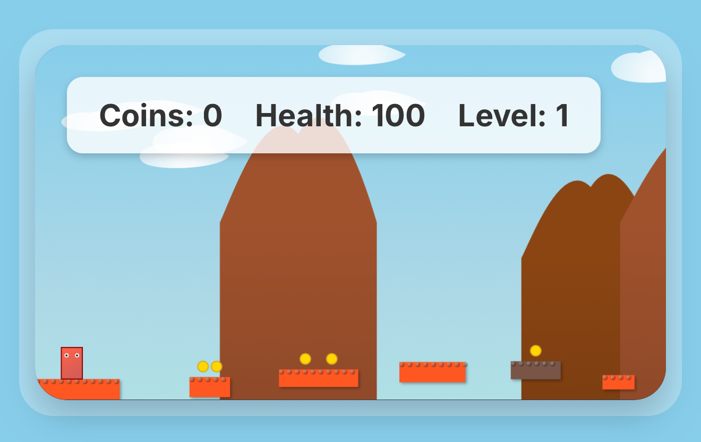

# Skirby's World

Developer: [CyberSynapse](https://cybersynapse.ro/) 

##  **PLAY NOW**
### **➡️ [CLICK HERE TO PLAY THE GAME](https://opensource-for-freedom.github.io/skirbys_world/) ⬅️**

*Direct link to the live game: https://opensource-for-freedom.github.io/skirbys_world/*

A 2D HTML5 Canvas platformer game featuring Skirby, a blocky character on an adventure through dynamically generated levels. Built as a single self-contained PHP file with embedded JavaScript and CSS.

## About the Game

Skirby's World is a classic 2D platformer where you control Skirby, a red blocky character, as he jumps through procedurally generated levels collecting coins and avoiding enemies. The game features a skill system where you can spend collected coins to unlock new abilities.

## Game Features

- **Procedurally Generated Levels**: Each level is randomly generated with platforms, coins, and enemies
- **Skill System**: Purchase upgrades using collected coins:
  - Super Jump: Jump even higher
  - Spin Attack: Defeat enemies with a spinning move
  - Punch Power: One-shot most enemies  
  - Flight: Soar through the skies with limited fuel
- **Multiple Themes**: Levels feature different visual themes (spring, summer, autumn, winter)
- **Boss Battle**: Face off against the Soap Boss with mustache
- **Sound Effects**: Audio feedback using Tone.js for jumps, walking, and combat
- **Responsive Design**: Scales to different screen sizes

## How to Play

### Controls
- **A/D** or **Arrow Keys**: Move left and right
- **Spacebar**: Jump
- **W/S** (with Flight skill): Fly up and down
- **E** (with Spin Attack): Activate spin attack
- **F** (with Punch Power): Punch attack
- **C**: Open cheat code input

### Gameplay
1. Move Skirby through the level using the arrow keys or WASD
2. Jump on platforms and collect yellow coins
3. Avoid or defeat purple enemies
4. Reach the golden exit platform to advance to the next level
5. Visit the shop between levels to purchase new skills
6. Face the boss battle after progressing through boss battle

## Development

### Prerequisites
- Python 3 (for local development server)
- Node.js and npm (for build scripts and validation)
- Modern web browser with HTML5 Canvas support

### Running Locally (Coming Soon)
1. Clone the repository
2. Install dependencies: `npm install`
3. Start development server: `npm run dev`
4. Open http://localhost:8000/index.php in your browser

### Building for 
- Build the game: `npm run build`
- Built files will be placed in the `dist/` folder
- Run tests: `npm test`
- Validate deployment: `./validate-deployment.sh`

### Deployment to GitHub Pages
The game automatically deploys to GitHub Pages when pushed to the `main` branch:

1. **Push to main** → Triggers GitHub Actions workflow
2. **Build process** → Creates optimized `dist/` folder  
3. **Deploy** → Publishes to GitHub Pages
4. **Live game** → Available at repository GitHub Pages URL

For detailed deployment information, see [DEPLOYMENT.md](DEPLOYMENT.md).

### Technical Details
- **Modular Architecture**: ES6 modules for organized code structure
- **HTML5 Canvas**: High-performance 2D game rendering
- **Responsive Design**: Tailwind CSS for mobile/desktop compatibility
- **Audio System**: Tone.js for dynamic sound effects
- **Build System**: Automated build validation and deployment
- **GitHub Pages**: Automated deployment via GitHub Actions

## License

MIT License - see LICENSE file for details

## Author

Tim Burns
